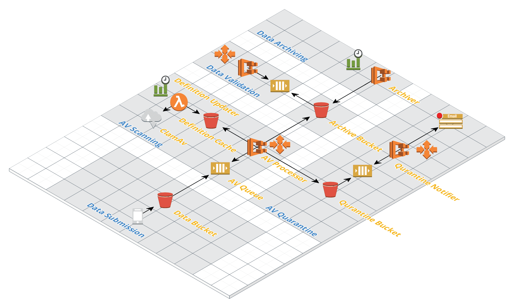

# Solution overview

The solution is based on an asynchronous worker process using queues to pass work between the various tasks that need to be completed. S3 Event notifications provide the SQS queue items based on file updates in specific prefixes

## Sections

The solution is broken up into 6 sections

### Data input

Data input is where raw data submitted by the Passport Scanner app is stored. Data saved here is short lived and should not be persisted in this location

On the creation of objects in the data bucket an S3 notification is sent to the AV Scanning Queue

### Anti Virus Scanning

The anti virus worker scans each file in the data input bucket for malicious software which could have been uploaded through the mobile app.

Depending on the scanning outcome, one of two actions will be performed

- Virus Found - The file is moved from the data input bucket to the Quarantine Bucket
- Clean file - The file is moved to the archive bucket

The AV virus definitions are stored in a local S3 cache and updated using a scheduled lambda function ( https://github.com/upsidetravel/bucket-antivirus-function ). This reduces the time in downloading definition files and also removes an external dependency on the ClamAV service during scanning.

The AV process is run independently from the business data validation process from a loose coupling perspective and to also isolate malicious files from our business logic and archival data in the event of a malicious file executing in the environment

### Quarantine

When an object is added to the quarantine bucket a S3 Event notification is added to the Quarantine notification Queue. A worker watches this queue and alerts an appropriate person that a virus has been detected.

Using a dedicated bucket for this process ensures that a malicious file can not be accessed by business areas or further processed by our workflow

### Archive

The archive is where the data is stored. When an object is received from the anti virus scanning processor in a dedicated prefix in the archive an S3 Event notification adds an event in the data validation processor queue

### Data Validation

The data validation worker reads the file and validates its contents based on the business requirements. Based on the outcome of this processing the file is moved into a specific prefix in the archive

### Archiving Process

On a timed schedule the archive worker is invoked which collects files in the archive based on their creation data and generates a zip based archive of the files. The worker then places these archive files in a specific prefix in the Archive bucket

## Infrastructure

### Worker Infrastructure

All workers in this solution will be deployed using docker based images. This provides maximum compatibility between the local development experience and the AWS deployment.

Queue based workers will be deployed as Fargate ECS services. The services will be configure with an autoscaling policy which tracks the length of the queue that the worker consumes. If there are no item in the queue no tasks will be running in the service. When an item is added to the queue a new task will start which will be initialised and poll the queue processing as many tasks as it can. When the queue has been empty for a length of time the tasks will be stopped again.

This approach allows for long setup processes such as AV definition updating while also considering the cost of unused resources, tasks are only active when there is work to do.

Time based workers will be Fargate ECS Tasks which are invoked using CloudWatch Events. This provides a standard way to invoke the tasks without having to maintain a scheduling service.

### Worker Queue Items

All worker queue items will receive items from S3 Notifications (https://docs.aws.amazon.com/AmazonS3/latest/dev/NotificationHowTo.html ). This provides a standard event structure that workers can consume to determine the actions that they need to take.
